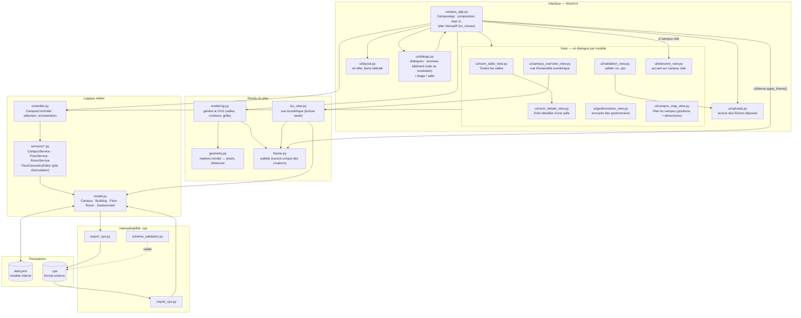
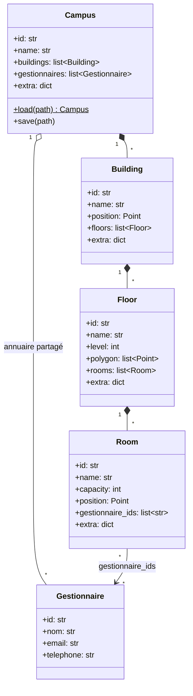
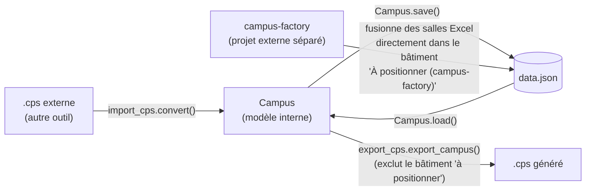

# Administration Campus

Application desktop/web (NiceGUI) pour éditer la géométrie d'un campus —
bâtiments, étages (contour), salles (position, capacité, gestionnaires) — et
échanger ces données avec le format `.cps` d'un autre projet.

## Stack technique

- **Python 3.11+**, dépendances gérées avec **uv** (`pyproject.toml`, `[tool.uv] package = false`)
- **NiceGUI** (3.x) pour l'UI : serveur local + page web, ouverte automatiquement dans un navigateur/fenêtre
- **jsonschema** pour valider les fichiers `.cps` contre `campus_schema.json`
- **platformdirs** pour localiser le `data.json` utilisateur hors du bundle une fois packagé
- **PyInstaller** pour la distribution desktop (voir les `.spec` à la racine du dépôt)

## Démarrer

```bash
uv sync
uv run src/main.py          # équivalent : .venv/bin/python src/main.py
```

Tests (config `pythonpath = src` dans `pytest.ini`) :

```bash
uv run pytest
```

Lint (config dans `[tool.ruff]` de `pyproject.toml`) :

```bash
uv run ruff check .          # uv run ruff check --fix .  pour corriger
```

En plus des règles par défaut, `B` (bugbear) est activé : il attrape les
pièges silencieux comme `assert False` (supprimé par `python -O`) ou un
`raise` sans `from` qui masque la cause d'origine.

Le serveur NiceGUI est lancé avec `reload=False` (voir le commentaire dans
`campus_app.main()`) : un process déjà démarré ne recharge jamais le code
modifié, il faut l'arrêter et le relancer après un changement.

### Les données ne sont pas versionnées

`src/data.json` est le campus de travail : il est dans `.gitignore`, et
l'exécutable packagé n'embarque aucune donnée non plus (voir `build.py`).
Deux raisons : le fichier est réécrit à chaque interaction avec l'appli, ce
qui produit des diffs bruyants sans intérêt d'historique ; et il contient un
campus réel avec l'annuaire des gestionnaires (noms, emails, téléphones), qui
n'a rien à faire dans un dépôt qu'on peut pousser, ni dans un exécutable
qu'on distribue.

Un clone frais et un premier lancement démarrent donc sur un **campus vide** :
`get_data_path()` crée le fichier (et le signale sur la sortie d'erreur en
dev), puis l'UI ouvre le dialogue d'accueil (`ui/welcome_view.py`) qui propose
d'importer un `.cps` ou de créer un premier bâtiment. Ce dialogue se déclenche
sur **`campus.buildings` vide**, pas sur l'absence du fichier : le fichier
étant recréé au premier démarrage, se fier à son absence ne proposerait
l'accueil qu'une seule fois.

Corollaire à connaître : `git checkout src/data.json` n'est plus un filet de
sécurité. Les versions d'avant le délistage restent lisibles dans l'historique
(`git show <commit>:src/data.json`), mais la seule sauvegarde vivante des
données est désormais l'export `.cps`.

## Architecture



Points clés :

- **`campus_app.py` est la racine de composition** : il construit la page
  NiceGUI, détient l'état de sélection courant (bâtiment/étage affiché, mode
  d'interaction sur le plan) et délègue les actions au `CampusController`.
  Le plan interactif (glisser une salle, dessiner un contour d'étage,
  éditer ses sommets) est piloté par un unique gestionnaire `on_mouse`, qui
  se comporte différemment selon `state["mode"]`
  (`None` / `placing_room` / `drawing_floor` / `editing_geometry`).
- **`controller.py` ne contient pas de règles métier** : il valide les
  entrées de haut niveau et délègue à `services/` (un service par entité :
  `CampusService`, `FloorService`, `RoomService`), qui manipulent
  directement les dataclasses de `model.py`.
- **`model.py` est la seule source de vérité** pour la forme des données et
  leur sérialisation JSON (`Campus.load` / `Campus.save`) — indépendant de
  NiceGUI, testable sans UI.
- **`rendering.py` / `geometry.py`** transforment le modèle en SVG (le plan
  affiché est une image SVG encodée en data URI, redessinée à chaque
  interaction) ; ils ne modifient jamais le modèle.
- **`iso_view.py`** empile les étages en volume : `SLAB_THICKNESS` est
  l'épaisseur d'une dalle, `FLOOR_HEIGHT` l'espacement d'un dessous de dalle
  au suivant. Les dalles sont volontairement fines et rapprochées (0.44 pour
  1.6) — avec les valeurs épaisses d'origine (2.2 pour 11), les niveaux
  flottaient loin les uns des autres au lieu de se lire comme un bâtiment.
  Deux invariants à préserver en retouchant ces constantes : `SLAB_THICKNESS`
  doit rester inférieur à `FLOOR_HEIGHT` (sinon les étages se traversent), et
  les étiquettes d'étage sont émises **après toutes les dalles** du bâtiment,
  car l'ordre du document SVG est l'ordre de peinture — dessinées au fil des
  étages, elles seraient recouvertes par la dalle du dessus.
- **`theme.py` est la source unique des couleurs.** Il est volontairement
  sans dépendance à NiceGUI, pour être importable par la couche de rendu SVG
  (`rendering.py`, `iso_view.py`) autant que par `ui/theme.py`, qui se limite
  à pousser la palette dans le thème Quasar via `apply_theme()`. Toute
  nouvelle couleur s'ajoute là plutôt qu'en dur dans un f-string SVG.
  Attention : les couleurs injectées dans du SVG/HTML le sont par
  interpolation de f-string — une chaîne portant un `{NOM}` doit bien avoir
  son préfixe `f`, sinon le placeholder ressort littéralement dans la page.

### Modèle de données



Chaque entité porte un champ `extra: dict` libre, qui conserve tous les
champs `.cps` d'origine non modélisés explicitement (access, equipments,
dimensions, zoneMarkers, id numérique, etc.). C'est ce qui permet à
`export_cps.py` de reconstruire un fichier quasi identique à l'original, en
n'y répercutant que ce que l'utilisateur a réellement changé dans l'appli
(nom, capacité, position, contour, disponibilité, gestionnaires).

### Import / export `.cps` et intégration avec campus-factory



`campus-factory` est un outil séparé qui rapproche un export Excel des
salles avec le `.cps` existant, et fusionne les nouvelles salles
**directement dans `data.json`** (pas via `import_cps.py`) : elles
atterrissent dans un bâtiment placeholder `"À positionner (campus-factory)"`
à la position `(0, 0)`, `available = False`, en attendant un vrai
positionnement. Côté campus-v2 :

- la fiche détaillée d'une salle propose une action **"Déplacer vers un
  autre étage"** (`controller.move_room`) qui la sort de ce bâtiment vers un
  étage réel, en la plaçant au centre du contour cible (`geometry.polygon_centroid`)
  pour qu'elle reste visible et puisse être affinée par glisser-déposer ;
- `export_cps.py` exclut ce bâtiment placeholder de tout export, pour ne
  jamais propager de salles sans géométrie réelle vers le format externe.

### Nom du campus et sessions

La carte **Session** de la barre latérale affiche le nom du campus en
lecture, avec un crayon qui révèle le champ de saisie (`campus_name_view`,
un `@ui.refreshable` local à `build_sidebar`, dont l'état d'édition tient
dans un simple dict). Le renommage est ainsi un geste délibéré — validé par
Entrée ou par le bouton, annulable — plutôt qu'une frappe qui réécrit
`data.json` au fil de l'eau.

Le champ édite `Campus.name`, qui n'est pas une étiquette d'affichage : c'est
le champ `name` du `.cps` produit par `export_cps.py`, et le nom de fichier
proposé par défaut à l'export. `CampusService.rename_campus()` refuse donc un
nom vide, qui casserait les deux, et `CampusApp.rename_campus()` retourne
`False` dans ce cas pour que la saisie reste ouverte — l'utilisateur corrige
sans avoir à rouvrir l'édition.

L'étiquette du sélecteur de session, elle, vient du **nom du fichier
importé** (`add_session()`), pas du modèle. Renommer le campus renomme aussi
la session qui le porte, sans quoi le sélecteur continuerait d'afficher
l'ancien nom de fichier pour un campus qui s'exporte désormais sous un autre
nom.

### Annulation des éditions de contour

Chaque geste sur un contour (glisser un sommet, en ajouter un sur une arête,
en supprimer un au double-clic) réécrit `data.json` immédiatement : un sommet
déplacé ou supprimé par erreur serait donc perdu. `FloorGeometryEditor`
(dans `services/floor_service.py`) tient une pile d'annulation pour ça, et le
mode édition affiche deux boutons en plus de « Terminer l'édition » :

- **Annuler** (`Ctrl+Z`, via un `ui.keyboard` enregistré dans la barre
  d'édition, donc retiré avec elle quand on quitte le mode) revient d'un
  geste en arrière ;
- **Rétablir l'état initial** revient au contour tel qu'il était à
  l'ouverture de l'édition. Ce retour est lui-même empilé : un « rétablir »
  malencontreux s'annule comme n'importe quel geste.

Deux subtilités valent d'être connues avant de toucher à `on_mouse` :

- **Le point de reprise est pris au `mousedown`**, avant le glisser, puis
  jeté au `mouseup` si le contour n'a finalement pas bougé
  (`discard_if_unchanged`). Sans ce ménage, un simple clic sur un sommet —
  et donc chaque moitié d'un double-clic de suppression — empilerait une
  étape d'annulation sans effet.
- **La pile est attachée à une session** : un étage, de « Éditer le
  contour » à « Terminer ». Changer d'étage sans quitter le mode ouvre une
  session neuve (`ensure_geometry_session()`, appelé au rendu du plan), pour
  qu'une annulation ne puisse jamais restaurer un contour sur le mauvais
  étage. Elle vit en mémoire et ne survit pas au redémarrage : c'est un
  filet de sécurité sur le geste en cours, pas l'historique global du campus
  qui reste une idée ouverte plus bas.

### Bâtiments modulaires et mise à l'échelle

Dessiner un contour à la souris étage par étage est le mode « sur mesure »,
adapté aux bâtiments d'origine importés d'un `.cps`. Pour un immeuble à
plateaux identiques, le dialogue **« + Bâtiment »** propose en plus un mode
**modulaire** : on saisit largeur × profondeur, un nombre de niveaux et le
niveau le plus bas, et `CampusService.create_modular_building()` crée d'un
coup le bâtiment avec un rectangle répliqué (une copie indépendante par
étage, éditable ensuite comme n'importe quel contour). Les niveaux sont
nommés par `default_floor_name()` : `RDC`, `1er étage`, `2e étage`,
`Sous-sol -1`.

**Convention de repère** : le rectangle est ancré sur l'origine du repère
local (quadrant positif), comme les contours importés d'un `.cps`.
`building.position` désigne donc le **coin bas-gauche** de l'empreinte, pas
son centre — c'est ce qui rend `geometry.building_footprint()` cohérent
entre bâtiments dessinés, importés et modulaires.

Le dimensionnement à l'échelle du plan se fait dans **« Plan du campus »**,
qui porte désormais quatre colonnes éditables : `X` / `Y` (position) et
`Largeur` / `Profondeur` (encombrement). Modifier une dimension appelle
`CampusService.resize_building()`, qui met à l'échelle **tous** les contours
d'étage *et* les positions de salle depuis le coin bas-gauche : les salles
gardent leur place relative dans le bâtiment. Les champs de taille sont
`debounce`és, sans quoi chaque frappe déclencherait une mise à l'échelle
intermédiaire (« 2 » avant « 25 »).

### Découpage du paquet `ui/`

**Un dialogue = un module**, nommé `*_view.py`. L'ancien `views.py`, qui
portait quatre dialogues sur 449 lignes, a été éclaté en
`room_table_view.py`, `gestionnaires_view.py`, `campus_map_view.py` et
`validation_view.py`. La fiche détaillée d'une salle, imbriquée dans la table
des salles alors qu'elle en représentait plus de la moitié, vit dans son
propre `room_details_view.py` : elle reçoit un callback `on_change` au lieu
de capturer le `rows_view` de l'appelant, ce qui la rend ouvrable depuis
n'importe quelle liste.

Deux règles maintiennent ce découpage praticable :

- **Aucun module de `ui/` n'importe `campus_app`.** Les vues reçoivent l'objet
  `app` en paramètre et passent par `app.controller`. C'est ce qui a permis
  l'éclatement : `views.py` importait auparavant `_read_uploaded_file` depuis
  `campus_app`, qui l'importait en retour, cycle qui ne tenait qu'à la
  position de ce helper au milieu du bloc d'imports. Il vit maintenant dans
  `ui/uploads.py`, module neutre, sous le nom `read_uploaded_file` (sans
  préfixe `_` : partagé, donc public). `ui/dialogs.py` migre vers la même
  signature : `open_new_building_dialog(app)` passe par `app.controller` et
  `app.refresh_campus_selection()` (méthode rendue publique pour ça) au lieu
  de recevoir six widgets et callbacks en paramètres.
- **Les vues ne sont pas couvertes par les tests** (NiceGUI construit l'UI par
  effet de bord). Après un remaniement, le filet de sécurité est de lancer
  l'appli et d'ouvrir chaque dialogue — une page de test qui les construit
  tous suffit à détecter les erreurs de construction.

## Roadmap / idées

- [x] Nettoyer le code redondant après modularisation
- [x] Casser le cycle `campus_app` ↔ `ui/views` (helper `read_uploaded_file`)
- [x] Eclater les vues vers des fichiers dédiés
- [x] Création de bâtiments modulaires (rectangle, étages identiques) et dimensionnement à l'échelle depuis « Plan du campus »
- [x] Annuler les éditions de contour d'étage (pile par session + Ctrl+Z)
- [x] Délister `data.json` et accueillir un campus vide par une proposition d'import
- [x] Éditer le nom du campus (celui qui part dans le `.cps` exporté)

#### Idées

Navigation inverse : dans la table "Toutes les salles" (ou la fiche détaillée), un bouton "Localiser sur le plan" qui ferme le dialog, bascule bâtiment/étage sur la bonne sélection et centre la vue sur la salle. C'est l'exact symétrique du double-clic qu'on vient d'ajouter.

**2. Qualité et intégrité des données**
- Finir la validation JSON schema — c'était déjà noté comme tâche ouverte : verrouiller les enums réels (roomType, access, type) extraits de model.py, pour que "Valider .cps" détecte vraiment les incohérences plutôt que de rester permissif.
- Rapport d'intégrité : un dialog "Salles sans gestionnaire", "Capacité à 0 ou suspecte", "Doublons de nom de salle" — utile après un import .cps massif pour repérer les trous.
- Gestionnaires orphelins : afficher/nettoyer les Gestionnaire qui ne sont assignés à aucune salle (accumulation possible après des suppressions de salles).

**3. Productivité sur les tables**
- Tri et filtres avancés dans "Toutes les salles" : par capacité, par bâtiment, par "a un gestionnaire / n'en a pas".
- Édition en masse : sélection multiple de salles pour assigner un gestionnaire à plusieurs salles d'un coup (la logique assign_gestionnaires_to_room s'y prête déjà, il manque l'UI de sélection groupée).
- Import annuaire en masse : un CSV nom/email/téléphone → création groupée de Gestionnaire, pour éviter la saisie un par un.

**4. Export et reporting**
- Export CSV/Excel de la table des salles ou des gestionnaires (facilities/RH en ont souvent besoin hors de l'appli).
- Statistiques simples : capacité totale par bâtiment/étage, nombre de salles par gestionnaire — un petit dashboard, potentiellement dans le dialog "Plan du campus" existant.

**5. Robustesse**
- Historique/undo global : l'annulation existe pour l'édition d'un contour d'étage (voir plus haut), mais toutes les autres modifications sauvegardent immédiatement (`app.save()`) sans retour en arrière. Étendre le principe aux salles, aux gestionnaires et aux redimensionnements de bâtiment — ou un horodatage de sauvegarde automatique avec restauration — sécuriserait les manipulations en masse (import, édition groupée).
