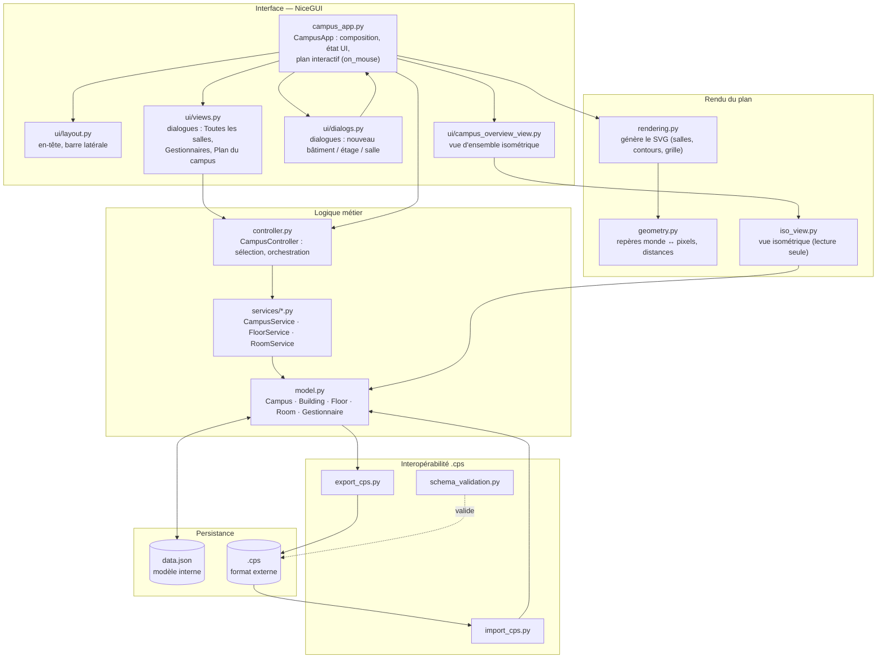
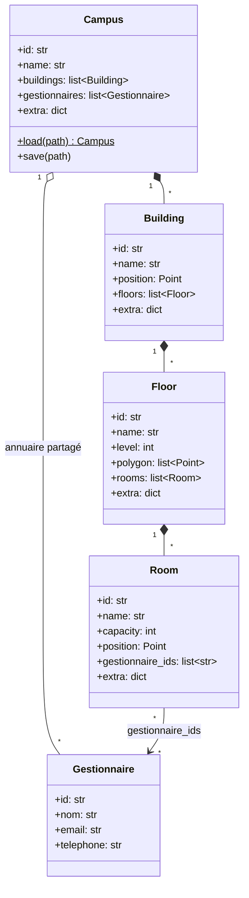
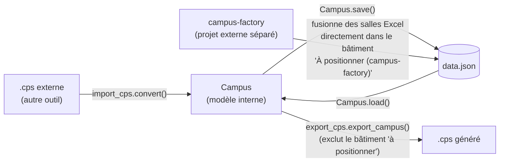

# Administration Campus

Application desktop/web (NiceGUI) pour éditer la géométrie d'un campus —
bâtiments, étages (contour), salles (position, capacité, gestionnaires) — et
échanger ces données avec le format `.cps` d'un autre projet.

## Stack technique

- **Python 3.11+**, dépendances gérées avec **uv** (`pyproject.toml`, `[tool.uv] package = false`)
- **NiceGUI** (3.x) pour l'UI : serveur local + page web, ouverte automatiquement dans un navigateur/fenêtre
- **jsonschema** pour valider les fichiers `.cps` contre `campus_schema.json`
- **platformdirs** pour localiser le `data.json` utilisateur hors du bundle une fois packagé
- **PyInstaller** pour la distribution desktop (voir les `.spec` à la racine du dépôt)

## Démarrer

```bash
uv sync
uv run src/main.py          # équivalent : .venv/bin/python src/main.py
```

Tests (config `pythonpath = src` dans `pytest.ini`) :

```bash
uv run pytest
```

Le serveur NiceGUI est lancé avec `reload=False` (voir le commentaire dans
`campus_app.main()`) : un process déjà démarré ne recharge jamais le code
modifié, il faut l'arrêter et le relancer après un changement.

## Architecture



Points clés :

- **`campus_app.py` est la racine de composition** : il construit la page
  NiceGUI, détient l'état de sélection courant (bâtiment/étage affiché, mode
  d'interaction sur le plan) et délègue les actions au `CampusController`.
  Le plan interactif (glisser une salle, dessiner un contour d'étage,
  éditer ses sommets) est piloté par un unique gestionnaire `on_mouse`, qui
  se comporte différemment selon `state["mode"]`
  (`None` / `placing_room` / `drawing_floor` / `editing_geometry`).
- **`controller.py` ne contient pas de règles métier** : il valide les
  entrées de haut niveau et délègue à `services/` (un service par entité :
  `CampusService`, `FloorService`, `RoomService`), qui manipulent
  directement les dataclasses de `model.py`.
- **`model.py` est la seule source de vérité** pour la forme des données et
  leur sérialisation JSON (`Campus.load` / `Campus.save`) — indépendant de
  NiceGUI, testable sans UI.
- **`rendering.py` / `geometry.py`** transforment le modèle en SVG (le plan
  affiché est une image SVG encodée en data URI, redessinée à chaque
  interaction) ; ils ne modifient jamais le modèle.

### Modèle de données



Chaque entité porte un champ `extra: dict` libre, qui conserve tous les
champs `.cps` d'origine non modélisés explicitement (access, equipments,
dimensions, zoneMarkers, id numérique, etc.). C'est ce qui permet à
`export_cps.py` de reconstruire un fichier quasi identique à l'original, en
n'y répercutant que ce que l'utilisateur a réellement changé dans l'appli
(nom, capacité, position, contour, disponibilité, gestionnaires).

### Import / export `.cps` et intégration avec campus-factory



`campus-factory` est un outil séparé qui rapproche un export Excel des
salles avec le `.cps` existant, et fusionne les nouvelles salles
**directement dans `data.json`** (pas via `import_cps.py`) : elles
atterrissent dans un bâtiment placeholder `"À positionner (campus-factory)"`
à la position `(0, 0)`, `available = False`, en attendant un vrai
positionnement. Côté campus-v2 :

- la fiche détaillée d'une salle propose une action **"Déplacer vers un
  autre étage"** (`controller.move_room`) qui la sort de ce bâtiment vers un
  étage réel, en la plaçant au centre du contour cible (`geometry.polygon_centroid`)
  pour qu'elle reste visible et puisse être affinée par glisser-déposer ;
- `export_cps.py` exclut ce bâtiment placeholder de tout export, pour ne
  jamais propager de salles sans géométrie réelle vers le format externe.

### État du découpage UI

Le paquet `ui/` est en cours de scission depuis `views.py` (voir la roadmap
ci-dessous) : `ui/campus_overview_view.py` est bien branché, mais
`ui/roommanagers_view.py` (duplicata non utilisé de `open_gestionnaires_dialog`)
et `ui/roomtable_view.py` (fichier vide) ne sont importés nulle part — à
finir ou supprimer avant que d'autres n'y touchent par erreur.

## Roadmap / idées

- [ ] Nettoyer le code redondant après modularisation
- [ ] Eclater les vues vers des fichiers dédiés.

#### Idées

Navigation inverse : dans la table "Toutes les salles" (ou la fiche détaillée), un bouton "Localiser sur le plan" qui ferme le dialog, bascule bâtiment/étage sur la bonne sélection et centre la vue sur la salle. C'est l'exact symétrique du double-clic qu'on vient d'ajouter.

**2. Qualité et intégrité des données**
- Finir la validation JSON schema — c'était déjà noté comme tâche ouverte : verrouiller les enums réels (roomType, access, type) extraits de model.py, pour que "Valider .cps" détecte vraiment les incohérences plutôt que de rester permissif.
- Rapport d'intégrité : un dialog "Salles sans gestionnaire", "Capacité à 0 ou suspecte", "Doublons de nom de salle" — utile après un import .cps massif pour repérer les trous.
- Gestionnaires orphelins : afficher/nettoyer les Gestionnaire qui ne sont assignés à aucune salle (accumulation possible après des suppressions de salles).

**3. Productivité sur les tables**
- Tri et filtres avancés dans "Toutes les salles" : par capacité, par bâtiment, par "a un gestionnaire / n'en a pas".
- Édition en masse : sélection multiple de salles pour assigner un gestionnaire à plusieurs salles d'un coup (la logique assign_gestionnaires_to_room s'y prête déjà, il manque l'UI de sélection groupée).
- Import annuaire en masse : un CSV nom/email/téléphone → création groupée de Gestionnaire, pour éviter la saisie un par un.

**4. Export et reporting**
- Export CSV/Excel de la table des salles ou des gestionnaires (facilities/RH en ont souvent besoin hors de l'appli).
- Statistiques simples : capacité totale par bâtiment/étage, nombre de salles par gestionnaire — un petit dashboard, potentiellement dans le dialog "Plan du campus" existant.

**5. Robustesse**
- Historique/undo : actuellement chaque modification sauvegarde immédiatement (app.save()), sans possibilité de revenir en arrière. Un simple undo sur la dernière action, ou un horodatage de sauvegarde automatique avec restauration, sécuriserait les manipulations en masse (import, édition groupée).
